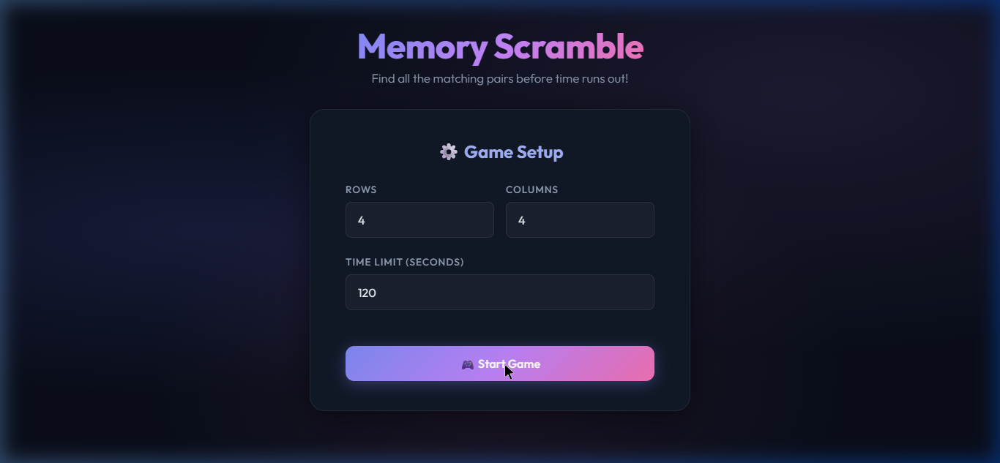
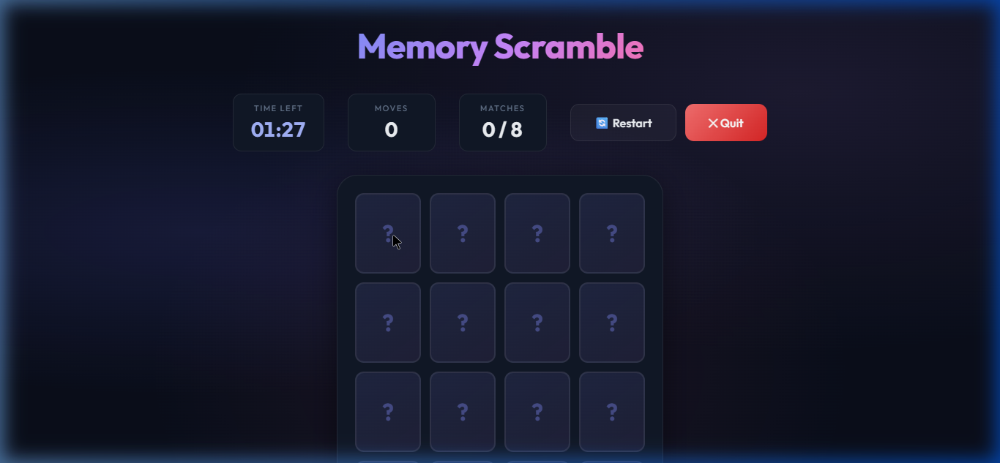
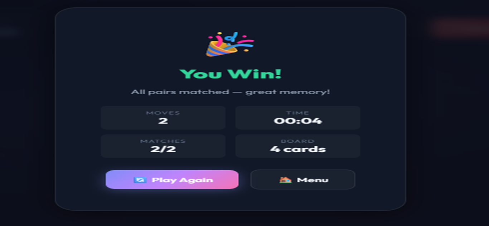
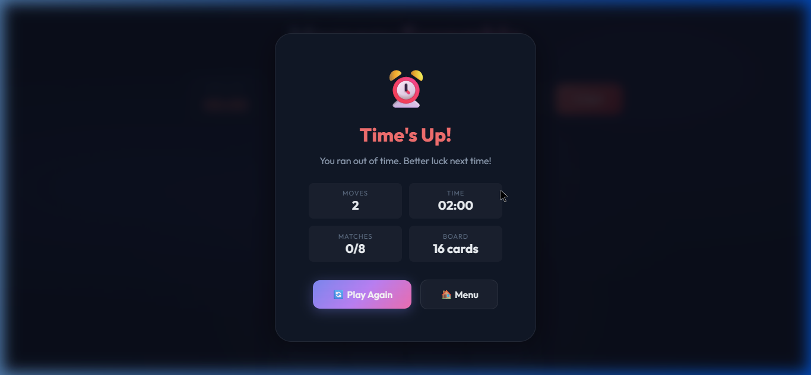

# 🧠 Memory Scramble

## 🎮 Live Demo

👉 **[Play Memory Scramble Online](https://wsamir2.github.io/memory-scramble/)**

[](https://wsamir2.github.io/memory-scramble/)

A card-matching memory game built with HTML, CSS, and JavaScript using the MVC (Model-View-Controller) architecture pattern.


# 📋 Table of Contents

- [Overview](#-overview)
- [Features](#-features)
- [Architecture](#-architecture)
- [Technologies Used](#-technologies-used)
- [How to Build & Run](#-how-to-build--run)
- [How to Play](#-how-to-play)
- [Project Structure](#-project-structure)
- [Git Workflow](#-git-workflow)
- [Team Members](#-team-members)
- [Audio System](#-audio-system)
- [Screenshots](#-screenshots)
- [License](#-license)

  
## 🎯 Overview

**Memory Scramble** is a single-player card game where the player flips face-down cards to find matching pairs. The player must match all pairs before the countdown timer reaches zero.

The game supports:
- Configurable board sizes
- Adjustable time limits
- Responsive gameplay
- Animated card interactions
- Gameplay sound effects
- MVC-based architecture

---

## ✨ Features

- Configurable Board Size — Set rows and columns (total cells must be even)
- Configurable Time Limit — Choose between 10 and 600 seconds
- Countdown Timer — Live timer displayed on screen during gameplay
- Game Over — Displays a message when the timer reaches zero before all cards are matched
- Win Condition — Congratulations modal when all pairs are matched
- Card Flip Animation — Smooth 3D flip animations with CSS transforms
- Match/Mismatch Feedback — Visual glow for matches and shake animation for mismatches
- Gameplay Sound Effects — Audio feedback for card flips, matches, mismatches, and winning states
- Responsive Design — Works on desktop and mobile screens
- MVC Architecture — Clean separation of concerns
- Keyboard Friendly — Supports Enter key on setup screen

## Architecture

The project follows the **MVC (Model-View-Controller)** design pattern:

| Layer          | File                 | Responsibility                                     |
| -------------- | -------------------- | -------------------------------------------------  |
| **Model**      | `js/model.js`        | Game state, card data, validation, business logic  |
| **View**       | `js/view.js`         | DOM rendering, UI updates, modals                  |
| **Controller** | `js/controller.js`   | Event handling, game loop, orchestration           |
| **Entry**      | `js/app.js`          | Bootstraps and wires MVC components                |

Data Flow
User Action → Controller → Model (update state) → Controller → View (update DOM)
## Technologies Used

| Technology     | Purpose                          |
| -------------- | -------------------------------- |
| HTML5          | Page structure and semantics     |
| CSS3           | Styling, animations, responsive  |
| JavaScript ES6 | Game logic and DOM manipulation  |
| Google Fonts   | Typography (Outfit font family)  |
| Git & GitHub   | Version control and collaboration|

## 🚀 How to Build & Run
📌 Prerequisites
A modern web browser (Chrome, Firefox, Edge, Safari)
No build tools, package managers, or servers required

Option 1: Open Directly

1. Clone the repository:
   ```bash
   git clone https://github.com/wsamir2/memory-scramble.git
   cd memory-scramble
   ```
2. Open `index.html` in your browser:
   ```bash
   # Windows
   start index.html

   # macOS
   open index.html

   # Linux
   xdg-open index.html
   ```

Option 2: Use a Local Server (recommended)

Using VS Code Live Server, Python, or Node:

```bash
# Python 3
python -m http.server 8080

# Node (npx)
npx serve .
```

Then open `http://localhost:8080` in your browser.

---

## 🎮 How to Play

1. Configure — Set the number of rows, columns, and time limit.
2. Start — Click "Start Game".
3. Flip — Click any face-down card to reveal it.
4. Match — Click a second card. If both icons match, they stay face-up.
5. Mismatch — If the icons don't match, both cards flip back face down.
6. Win — Match all pairs before the timer runs out!
7. Lose — If the timer reaches zero, the game is over.

---
## 📁 Project Structure

```text
memory-scramble/
├── index.html
├── css/
│   └── style.css
├── js/
│   ├── model.js
│   ├── view.js
│   ├── controller.js
│   └── app.js
├── assets/
│   └── sounds/
│       ├── flip.mp3
│       ├── match.mp3
│       ├── wrong.mp3
│       └── win.mp3
├── docs/
│   ├── screenshot.png
│   ├── config-screen.png
│   ├── game-board.png
│   ├── win-modal.png
│   └── game-over.png
└── README.md
```

## 🔀 Git Workflow

Feature branches were reviewed and merged using Pull Requests to preserve collaboration history.

This project was developed using a feature-branch workflow:

Each team member worked on dedicated feature branches
Branches were merged into main using Pull Requests
Merge history was preserved to track collaboration
Commits follow the Conventional Commits standard


## 🌿 Branch Summary

| 🌿 Branch                             | 👤 Owner   | 🚀 Purpose                                                           |
| ------------------------------------- | ---------- | -------------------------------------------------------------------- |
| `feature/project-setup`               | Duaa   | Initial repository setup, MVC folder structure, and `.gitignore`     |
| `feature/html-structure`              | Walid  | Base HTML layout and MVC script integration                          |
| `feature/ui-base-styles`              | Walid  | CSS design system, dark aurora theme, typography, and layout styling |
| `feature/card-model`                  | Monica | Card class implementation, card states, and game phase enums         |
| `feature/game-logic`                  | Monica | Shuffle algorithm, matching logic, validation, and gameplay rules    |
| `feature/config-view`                 | Walid  | Game setup/configuration screen UI                                   |
| `feature/board-view`                  | Walid  | Dynamic game board rendering and responsive card layout              |
| `feature/controller-core`             | Duaa   | Event binding, controller orchestration, and gameplay flow           |
| `feature/timer-system`                | Duaa   | Countdown timer logic and lose-condition handling                    |
| `feature/card-animations`             | Walid  | Card flip, match, mismatch, and hover animations                     |
| `feature/modal-views`                 | Walid  | Win/Lose modals and overlay presentation                             |
| `feature/hud-updates`                 | Duaa   | HUD statistics updates and MVC integration flow                      |
| `feature/responsive-design`           | Walid  | Mobile responsiveness and adaptive board sizing                      |
| `feature/documentation`               | Duaa   | README documentation, workflow notes, and deployment instructions    |
| `feature/game-logic-polish`           | Monica | Logic documentation, shuffle comments, and readability improvements  |
| `feature/ui-polish`                   | Walid  | README demo enhancements and responsive UI refinements               |
| `feature/controller-docs-enhancement` | Duaa   | Controller documentation and workflow clarification                  |
| `feature/sound-effects`               | Walid  | Gameplay sound effects integration and audio feedback system         |
| `feature/audio-assets`                | Monica | Upload and management of gameplay audio assets                       |

---

## 👥 Team Members

| Name                    | Role                        | GitHub                                                |
| ----------------------- | --------------------------- | ----------------------------------------------------- |
| Walid Samir Sayed       | UI / Views / Styling        | [@wsamir2](https://github.com/wsamir2)                |
| Monica Alkess Beshara   | Models / Game Logic          | [@monica-alkess](https://github.com/monica-alkess)    |
| Duaa Hisham El Zain     | Controller / Timer / Docs    | [@duaa-hisham](https://github.com/duaa-hisham)        |

---
## 🔊 Audio System

The game includes integrated gameplay sound effects to improve user interaction and gameplay feedback.

Included Sound Effects
Event	Audio
Card Flip	flip.mp3
Successful Match	match.mp3
Wrong Match	wrong.mp3
Game Win	win.mp3
---
assets/sounds/
├── flip.mp3
├── match.mp3
├── wrong.mp3
└── win.mp3
---
## Screenshots

Configuration Screen


Game Board


Win Modal




Game Over


---

## 📄License

This project is developed for educational purposes.
